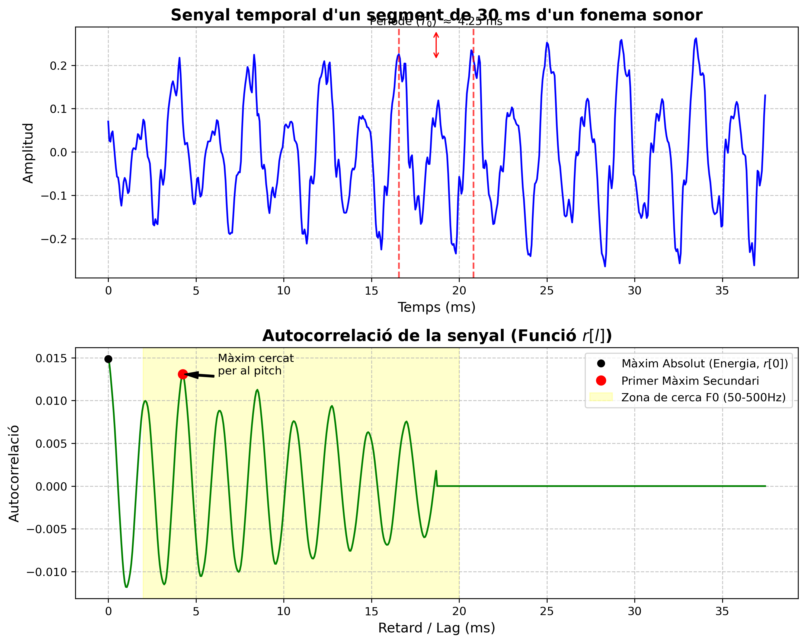
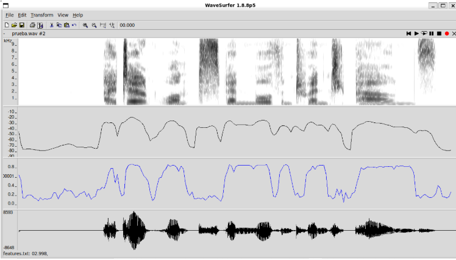
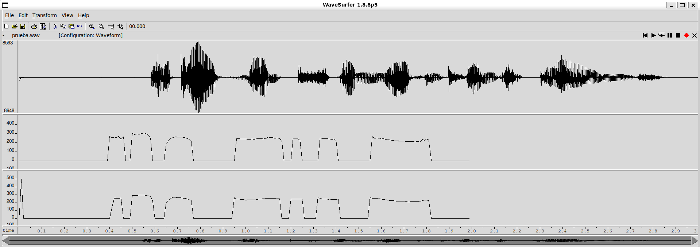
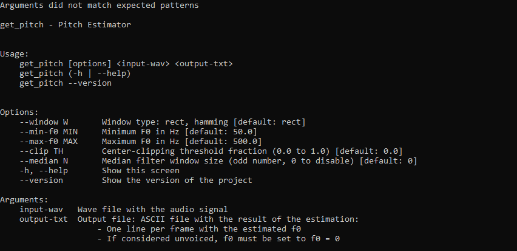

# Práctica de Procesamiento de Audio y Voz: Estimador de Pitch

**Autores:** Carlos Vargas, David Heredia

Este repositorio contiene la implementación y optimización de un sistema de estimación de pitch (frecuencia fundamental, $F_0$) basado en el cálculo de la autocorrelación temporal, desarrollado en C++.

---

## 1. Ejercicios Básicos

### 1.1. Cálculo de la Autocorrelación y Estimación del Pitch

El núcleo del estimador se basa en la función de autocorrelación discreta, implementada en `pitch_analyzer.cpp`. La fórmula utilizada es:

$$r[l] = \frac{1}{N} \sum_{n=l}^{N-1} x[n] \cdot x[n-l]$$

Donde $N$ es la longitud de la ventana de análisis (*frame*). Para encontrar el periodo de pitch ($T_0$), se busca el primer máximo secundario de la autocorrelación. Para evitar detectar el máximo global situado en el lag 0 (que representa la energía total de la señal), la búsqueda se restringe a un rango de retardos correspondiente a las frecuencias fundamentales típicas de la voz humana (entre `npitch_min` y `npitch_max`).

A continuación, se muestra la gráfica de un segmento de 30 ms de un fonema sonoro y su autocorrelación, generada mediante un script propio en Python `plot_autocorr.py`:



Como se puede observar en la gráfica, el primer máximo secundario de la autocorrelación (marcado en rojo) coincide de forma precisa con el periodo fundamental de la señal de voz en el dominio del tiempo $T_0 \approx 4.25$ ms, lo que equivale a un pitch de $\approx 235$ Hz.

---

### 1.2. Decisión Sonoro/Sordo (Voiced/Unvoiced)

Para determinar si una trama corresponde a un fonema sonoro (vocal) o sordo/silencio (consonantes fricativas, pausas), se han analizado las características extraídas de la señal utilizando la herramienta Wavesurfer.

Se ha modificado el programa para volcar los datos de potencia $r[0]$ y la autocorrelación normalizada en el máximo secundario $r_{\text{maxnorm}} = \frac{r[\text{lag}]}{r[0]}$, asegurando que se imprime un valor de "silencio" $-100$ dB en los *frames* con energía cero para mantener la sincronización temporal con la señal de audio de Wavesurfer.



#### Análisis Visual y Umbrales:
Observando la gráfica anterior, se aprecian dos comportamientos claros:
* **En las pausas/silencios:** La curva de potencia (negra) cae drásticamente. Por ello, se ha establecido un umbral conservador de $\text{pot} < -45$ dB para clasificar la trama como sorda.
* **En las consonantes sordas:** Aunque puede haber energía, la señal carece de periodicidad. Esto se refleja en caídas abruptas de la curva de $r_{\text{maxnorm}}$ (gráfica azul). Empíricamente, se ha comprobado que un umbral de $r_{\text{maxnorm}} < 0.43$ discrimina eficazmente los tramos sordos de los sonoros.

Ambos umbrales han sido codificados en el método `PitchAnalyzer::unvoiced()`.

---

### 1.3. Evaluación Base y Comparativa


En la gráfica que se ve abajo (`comparacionwavesurfer.png`), sin tener en cuenta que está descuadrada, se puede apreciar que nuestro `prueva.f0` es bastante similar a `f0ref`, por lo que a simple vista podríamos decir que la estimación es buena. Lo único que vemos es que al principio, como la señal comienza con una especie de potencia negativa, por el valor de nuestros parámetros se ve un pico al principio que hemos intentado arreglar.




---

## 2. Ejercicios de Ampliación

### 2.1. Inclusión de Parámetros por Línea de Comandos (docopt)

Se ha integrado y configurado la librería `docopt_cpp` en `get_pitch.cpp` para permitir la parametrización dinámica del estimador sin necesidad de recompilar. Se han añadido opciones para:
* Seleccionar el tipo de ventana (`--window`: rect o hamming).
* Definir los límites de búsqueda del pitch (`--min-f0` y `--max-f0`).
* Configurar las técnicas de mejora: umbral de Center Clipping (`--clip`) y tamaño del Filtro de Mediana (`--median`).



---

### 2.2. Técnicas de Mejora Implementadas

Para intentar incrementar la precisión del estimador y maximizar el *score* en la evaluación, se han implementado las siguientes técnicas de preprocesado y postprocesado:

#### A. Preprocesado: Center Clipping
La presencia de formantes puede generar picos en la autocorrelación que compiten con el pico del pitch real. Para mitigarlo, se ha implementado un sistema de Center Clipping.

* **Funcionamiento:** Se calcula el máximo absoluto del *frame* actual. A continuación, todas las muestras de la señal cuya amplitud no supere una fracción de este máximo (definida por `--clip`) se ponen a cero. Al resto de las muestras se les resta el umbral para suavizar la transición (*soft clipping*).
* **Beneficio:** Esta técnica "limpia" el ruido y la influencia de los formantes, haciendo que la autocorrelación resultante sea mucho más limpia y el máximo secundario destaque de manera evidente.


#### B. Postprocesado: Filtro de Mediana
Los estimadores de pitch basados en autocorrelación son propensos a errores puntuales aislados, como el *pitch doubling* (detectar el doble de la frecuencia real) o el *pitch halving* (detectar la mitad).

* **Funcionamiento:** Se ha implementado un filtro de mediana temporal. Para cada *frame*, se toma un entorno de tamaño $N$ (definido por `--median`, siendo $N$ un número impar), se ordenan los valores de $F_0$ estimados y se sustituye el valor central por la mediana estadística.
* **Beneficio:** Elimina eficazmente los picos de error aislados y suaviza la trayectoria (contorno) del pitch sin emborronar las transiciones bruscas genuinas (como el inicio o fin de una vocal), algo que sí haría un filtro de media convencional.

---

### 2.3. Optimización de Parámetros (Estudio Final)

Para ir probando los parámetros para buscar el óptimo, hemos cambiado el `run_get_pitch.sh` para ir jugando con las mejoras.

Después de bastantes pruebas, los cambios nuevos no parecen ayudar demasiado; hemos conseguido subir de **90,24% a 90,57%** con los siguientes parámetros:

```bash
PARAMS="--window rect --clip 0.0005 --median 3 --min-f0 50 --max-f0 500"
```

#### Sumary
```bash
Num. frames:    11200 = 7045 unvoiced + 4155 voiced
Unvoiced frames as voiced:      195/7045 (2.77 %)
Voiced frames as unvoiced:      520/4155 (12.52 %)
Gross voiced errors (+20.00 %): 40/3635 (1.10 %)
MSE of fine errors:     2.42 %

===>    TOTAL:  90.57 %
```